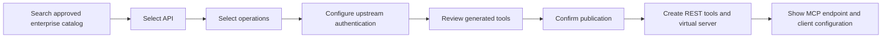

# Proposal: Discover Enterprise REST APIs and Publish Them as MCP Tools

**Status:** Proposed  
**Date:** 2026-10-03  
**Scope:** Search authorized enterprise API catalogs, let users select documented operations, and publish them to the current AI Gateway as REST tools and a virtual MCP server.

## Summary

This feature adds an enterprise API directory to the Admin UI. Users search APIs from approved internal sources, inspect operations from an OpenAPI document, configure upstream authentication, preview generated tools, and publish selected operations to the existing gateway.

The gateway already supports REST-backed tools, virtual MCP servers, and MCP invocation. The feature therefore focuses on catalog discovery, OpenAPI-to-tool conversion, publication workflow, and access control. It does not create a separate MCP deployment.

## Goals

- Search only API sources explicitly configured by an administrator.
- Filter catalog results and operations by the caller's visibility scope.
- Convert a documented and supported OpenAPI operation into a REST tool.
- Let the user review the generated tool and authentication configuration before publishing.
- Create the selected tools and a virtual MCP server in the current gateway.
- Return the MCP endpoint and generated tool names.
- Track publication status and clean up resources created by a failed publication.

## Non-goals for the first release

- Scanning arbitrary internal networks for services.
- Sending internal API names, schemas, or documents to a public search provider.
- Guessing endpoints or parameters for undocumented APIs.
- Publishing a standalone MCP container.
- Automatically granting callers the registering user's upstream identity.
- Supporting every OpenAPI extension, external `$ref`, OAuth authorization flow, file upload, or streaming response.

## User workflow



1. The administrator configures an API source: a fixed OpenAPI URL, an enterprise API management platform, or an approved Git repository.
2. The user searches the synchronized catalog by API name, description, provider, or tags.
3. The user selects an API and reviews its supported operations and required authentication.
4. The user selects operations, configures upstream credentials, and previews the generated MCP tool names and input schemas.
5. The user chooses visibility and confirms publication.
6. The gateway creates the REST tools and a virtual MCP server, then displays the MCP URL and selected tools.

## First-release compatibility

Support OpenAPI 3.0 and 3.1 JSON documents with a documented compatibility subset:

- HTTP methods: GET, POST, PUT, PATCH, and DELETE.
- Path parameters, scalar query parameters, headers, and JSON request bodies.
- Inline schemas and local component references that the converter can resolve safely.
- Upstream authentication: none, Basic, Bearer, or a configured API key header.
- JSON responses and ordinary text responses through the existing REST tool execution path.

Mark unsupported operations with a reason. Require manual review when the document omits required parameter or authentication details. Do not silently publish partially interpreted operations.

## Proposed architecture

### API directory

Store API source definitions and indexed API metadata in the database. Each source has an owner or team scope, source type, fixed location, synchronization status, last successful synchronization time, and document checksum. Fetch source documents only from administrator-approved locations.

Start with database-backed search. Add a dedicated search engine only after catalog size or measured query latency justifies it. Synchronize sources through bounded tasks. Store only the metadata needed for discovery and a versioned document snapshot or checksum for preview consistency.

### OpenAPI converter

Add a converter that accepts a versioned document snapshot and selected operation IDs. It produces validated REST tool inputs, including:

- Stable, slugified tool name and description that satisfy MCP tool-name rules; operation IDs may contain dots, slashes, or Unicode.
- Input schema assembled from path, query, header, and JSON body parameters.
- Explicit parameter mappings consumed by the REST invocation path.
- Output schema where a supported success response defines one.
- Authentication requirements and a clear indication of fields the user must supply.

Resolve the base URL from the document's `servers[]` list, including variable substitution, and merge path-item-level `parameters` with operation-level parameters using the required flags.

The converter must preserve REST request semantics. In particular, a request can have query parameters and a JSON body at the same time. The existing invocation path merges mapped query parameters into the JSON body, so the converter must emit an explicit per-location mapping (path, query, header, body). That invocation change is a Phase 0 gate.

### Publication service

Create tools and a virtual server through existing services. Record a publication ID, requested operation IDs, status, generated resource IDs, timestamps, and safe failure details.

Enforce idempotency in the database, not in application logic. Add a unique index on `(scope, idempotency_key)`, claim the key with an insert before creating any resource, and treat a constraint conflict as the replay path. Do not read an existing row and then insert.

The current tool and server registration services commit separately. Treat publication as a recoverable workflow, not one database transaction. Record each generated resource ID as soon as the resource is created, so cleanup deletes by recorded ID. Never delete by generated name: a name-based delete removes the first attempt's tools when a retry fails. Never delete pre-existing tools. A crash between a resource commit and its ID recording leaves an orphan; add a reconciliation step that matches unrecorded resources to a publication, and keep the failed task visible if cleanup fails.

### HTTP API

Proposed authenticated endpoints:

```text
GET  /api-sources
POST /api-sources
POST /api-sources/{source_id}/sync
POST /api-discovery/search
POST /api-discovery/preview
POST /api-publications
GET  /api-publications/{publication_id}
```

Names and route placement require API review before implementation. Apply RBAC to every route and use the canonical token-scoping helpers for directory visibility. The publication endpoint must derive owner and team context from the authenticated principal.

### Admin UI

Add a top-level "Enterprise APIs" entry to the admin navigation. The page carries three tabs: Search and Browse, Sources, and Publications. Update the REST API onboarding card to open this page on the Search tab. Show source, version, authentication, compatibility, and visibility before confirmation.

## Security and privacy requirements

- Require administrator permission to register or change catalog sources.
- Apply team and owner visibility to search, preview, source details, and publication history.
- Validate and pin every OpenAPI fetch URL and every upstream tool URL with the existing URL security controls.
- Permit internal targets only through explicit administrator-managed network policy. Do not permit user-supplied URLs to bypass SSRF checks.
- Do not fetch arbitrary URLs discovered inside OpenAPI documents. Resolve only allowed local references in the first release.
- Keep credentials in the existing encrypted credential storage. Never include secrets in search results, schemas, task records, error messages, or logs.
- Store source-fetch credentials separately from tool-invocation credentials. `openapi_service._do_fetch` sends no authentication header today, so the sync path needs its own authorized fetch credentials for catalogs that require a key or token.
- Set visibility explicitly to `private` at every creation call. `ServerService.register_server` defaults visibility to `"public"` and `ToolCreate.visibility` defaults to `None`, so an omitted argument publishes public.
- Do not treat the `allowlist` or `expose_passthrough` tool fields as an enforcement boundary. Neither is read on the invocation path today; egress control comes from the URL pinning policy in `SecurityValidator.validate_url_for_connection_pinning`.
- Treat catalog metadata and OpenAPI descriptions as untrusted input in templates and generated tool descriptions. Apply length limits and HTML escaping to generated descriptions.
- Keep Layer 1 resource visibility and Layer 2 permission checks independent on every request path.
- Add deny-path tests for unauthenticated users, wrong teams, insufficient permissions, and disabled feature flags, one per new route. The deny-path set and the live-gateway test are release gates, not optional coverage.

## Data model and migrations

Likely additions:

- `ApiSource`: source type, fixed source reference, owner/team scope, enabled state, and synchronization metadata.
- `ApiDocumentSnapshot` or an equivalent versioned JSON record: source ID, version/checksum, document metadata, and parsed operation index.
- `ApiPublication`: actor, scope, selected operations, status, idempotency key, generated resource IDs, and failure state, with a unique index on `(scope, idempotency_key)`.

Do not duplicate tool or virtual-server records. Link publication records to resources through stored IDs. Add an Alembic migration with the repository's verified current head and idempotent upgrade behavior; the migration is done only when `alembic heads` shows one head. Set a snapshot retention cap and deletion behavior before finalizing the schema: a versioned document can hold confidential schemas and grow without bound.

## Code areas likely to change

- `mcpgateway/services/openapi_service.py`: reuse secure fetching; add operation enumeration and complete parameter extraction in a focused converter.
- New API directory, converter, and publication services under `mcpgateway/services/`.
- A dedicated router and Pydantic request/response schemas.
- `mcpgateway/config.py` and `.env.example`: feature flag, limits, and source policy.
- `mcpgateway/admin_ui/` and templates: search, preview, and publication workflow.
- `mcpgateway/i18n/locales/en.json`, `es-ES.json`, `pt-BR.json`, and `zh-CN.json`: UI translations. Locale key parity is enforced by `tests/unit/mcpgateway/i18n/test_catalog.py`.
- Alembic migration and corresponding database models.
- Unit, integration, security, and live-gateway tests.
- Development documentation and the REST onboarding card.

## Feasibility and project impact

**Overall feasibility: high for a bounded OpenAPI-backed first release.** The project has already verified the REST-to-MCP execution path and has services for REST tools and virtual servers. The work does not require a new MCP transport.

**Conversion feasibility: medium to high.** The existing OpenAPI service fetches documents with SSRF protection and extracts schemas. It does not provide a complete operation catalog or all request mappings. Parameter mapping and credential UX are the main engineering unknowns. Validate them against representative internal APIs before building the full UI.

**Enterprise discovery feasibility: depends on source access.** Search is practical once the organization supplies an API management platform, approved OpenAPI locations, or a Git source. There is no safe or reliable way to discover every internal API from a keyword alone.

**Project impact: medium to high.** The feature adds database state, migrations, API authorization, an Admin UI flow, synchronization, and a recoverable multi-step publication process. It touches the core REST invocation path if existing mappings cannot represent combined parameter locations. Existing MCP protocol handling should remain reusable.

**Operational impact: moderate.** The gateway must reach approved documentation and API hosts. Synchronization requires bounded concurrency, timeouts, response-size limits, caching, and clear failure status. No search infrastructure is needed initially.

## Delivery phases

### Phase 0: Compatibility spike

Use representative internal OpenAPI documents to verify GET path/query mapping, POST JSON bodies, combined query-plus-body requests, API key headers, Bearer credentials, and SSRF policy. Identify changes required in the existing REST invocation mapping.

**Exit criteria:** Each supported sample produces a request accepted by its test upstream and returns the expected result through MCP. Unsupported cases have clear reasons.

### Phase 1: Fixed OpenAPI source to MCP

Register an approved document source, list operations, preview selected tools, configure credentials, and publish to one private virtual server.

**Exit criteria:** A user can publish one selected operation and call it through MCP. Repeating the same publication is safe. Failure cleanup never removes an existing tool.

### Phase 2: Enterprise directory search

Index approved source metadata, add search and visibility filtering, and show document version and synchronization health.

**Exit criteria:** Search returns only accessible APIs. Wrong-team and insufficient-permission requests fail closed.

### Phase 3: Enterprise source connectors

Add a connector for the organization's chosen API management platform or Git provider. Add bounded synchronization and document-change review.

**Exit criteria:** Synchronization is observable, restart-safe, rate-limited, and does not silently alter published tools.

### Phase 4: Compatibility expansion

Extend OpenAPI versions, schema references, authentication types, or parameter serialization based on real enterprise API usage.

**Exit criteria:** Every added feature has a documented compatibility rule and positive and negative regression coverage.

## Acceptance criteria

- Users search only administrator-approved API sources they are allowed to view.
- Users can select individual supported operations and review generated names, inputs, authentication, and visibility before publishing.
- The resulting virtual server exposes the selected tools through the existing MCP endpoint.
- An authenticated MCP `tools/list` shows the expected operations; `tools/call` sends correct path, query, header, and body values to a test upstream.
- Credentials never appear in API responses, search indexes, logs, or publication errors.
- Repeated publication is idempotent under concurrent same-key requests (one publication row per key), and partial failure is visible and recoverable.
- Cleanup deletes only resources recorded for that publication, and it survives a crash between a resource commit and its ID recording.
- Generated tools and the virtual server are private unless the user explicitly chooses otherwise.
- Security tests cover unauthenticated access, wrong team, insufficient permission, SSRF rejection, internal-network policy, and feature-disabled behavior, with one deny-path test per new route.
- A live-gateway test exercises publication and a real MCP tool call. This test and the deny-path set are release gates.

## Key risks and mitigations

| Risk | Impact | Mitigation |
| --- | --- | --- |
| No authoritative API source exists | Search returns incomplete or stale results | Select the enterprise source before Phase 2; start with a fixed OpenAPI URL |
| OpenAPI documents omit details or differ from runtime behavior | Generated tools fail at invocation | Compatibility spike, preview, and manual completion for missing fields |
| Query, path, and body mappings collide | Requests change meaning | Preserve parameter locations explicitly and test mixed-location operations |
| Service-account credentials widen access | Callers gain more upstream capability than intended | Visibility set explicitly to private at each creation call (`register_server` and `ToolCreate` do not default to private), team-scoped publication, explicit service-account warnings, RBAC |
| User-controlled URLs enable SSRF | Gateway reaches forbidden internal hosts | Admin-managed sources, URL pinning, host policy, no arbitrary reference fetching |
| Publication partially succeeds | Orphaned tools or servers | Database-unique idempotency key, cleanup by recorded resource ID, and a reconciliation step for the crash window |
| Internal schemas leak to external services | Confidential API structure is exposed | Keep discovery and parsing inside the gateway; use no public search provider |
| Document updates change generated calls | Existing clients break | Snapshot versions; require review and explicit republish |

## Decisions required before implementation

1. Which API management platform, Git source, or approved document repository is authoritative?
2. Should the first release allow only private visibility, or team visibility as well?
3. Which upstream authentication methods do the first target APIs require?
4. What OpenAPI versions and parameter styles occur in the target APIs?
5. What retention period applies to document snapshots and publication records?

## Tracking

Implementation work is tracked in the repository issue tracker.

| Topic | Issue |
| --- | --- |
| Per-location REST parameter mapping (path, query, header, body) | #17 |
| Database-enforced publication idempotency and cleanup by recorded ID | #18 |
| Explicit private visibility for generated resources | #19 |
| UI strings in all four locale catalogs | #20 |
| Tool-name namespacing and collision handling | #21 |
| Snapshot retention and source-lookup index | #22 |
| Source-fetch credentials for authenticated catalogs | #23 |
| OpenAPI `servers[]` and path-item parameter inheritance | #24 |
| Admin UI hierarchy, states, responsive behavior, and accessibility | #25 |

The durable decisions are recorded in [ADR-0057](../architecture/adr/057-enterprise-rest-to-mcp-publication-boundaries.md).
